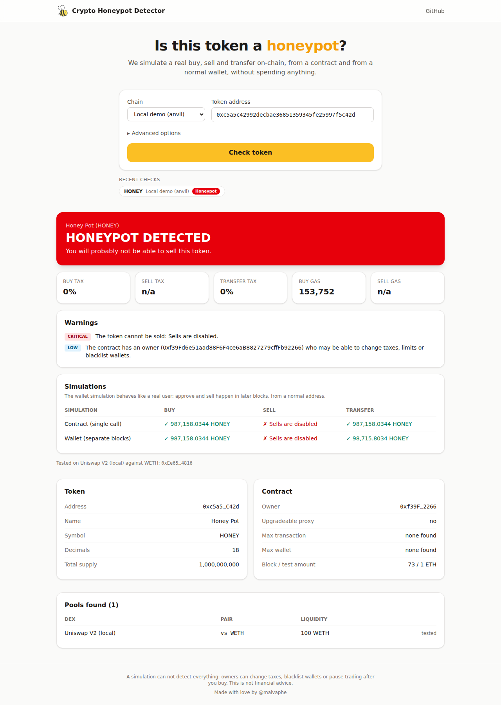

# Crypto Honeypot Detector



A honeypot detector for EVM chains: before you buy a token, it simulates a **buy, a sell and a
wallet-to-wallet transfer** and tells you whether you would be able to sell it, and with which taxes.

- **Nothing to deploy, no funds needed.** The simulation runs inside a read-only `eth_call`, with
  the simulator contract injected through state overrides. (Version 1 required you to deploy and
  fund a contract on every chain: not anymore.)
- **Two simulations.** One from a contract in a single call, one from a normal wallet with approve and
  sell in later blocks (`eth_simulateV1`), like a real user. This catches honeypots built to fool
  simulators: tokens that only let contracts sell, approvals that expire, sells allowed only when
  `gasprice == 0`, whitelisted simulator addresses.
- **Automatic pool discovery on-chain** (no subgraphs or third-party APIs): the pool with the most
  liquidity among all supported DEXes and base tokens is picked, or you can test every pool.
- **Uniswap V2 and V3 style DEXes** on 9 chains, plus any custom V2 router or V3 factory.
- Buy / sell / transfer taxes, gas, liquidity, owner, upgradeable proxy, max transaction and max
  wallet limits, readable revert reasons, and a risk level.
- Library, CLI, REST API and web app.

> A simulation can not detect everything: owners can still change taxes, blacklist wallets or pause
> trading after you buy. This is not financial advice.

## Project structure

The repository is an npm workspace with three packages:

| Package | What it is | Needs the web app? |
|---|---|---|
| [`packages/core`](packages/core) | Detection engine: JavaScript library + command line tool | no |
| [`packages/server`](packages/server) | REST API (and optionally serves the web app) | no |
| [`packages/webapp`](packages/webapp) | Web interface (React + Vite + Tailwind) that talks to the API | – |

The simulator contract source is in [`contracts/HoneypotSimulator.sol`](contracts/HoneypotSimulator.sol);
its compiled bytecode is committed in `packages/core/src/simulator-artifact.js`, so no Solidity
compiler is needed. See [`docs/SECURITY_REVIEW.md`](docs/SECURITY_REVIEW.md) for the security review
of the old contract and of the new design.

## Quick start

Requires Node.js 22 or newer.

```bash
git clone https://github.com/malvaphe/Crypto_Honeypot_Detector
cd Crypto_Honeypot_Detector
npm install
```

### Try it locally without any RPC

```bash
npm run demo
```

Starts a local chain (anvil) with the real Uniswap V2/V3 contracts and a set of example scam tokens
(classic honeypot, taxes, wallet-only honeypot, expiring approvals, anti-simulator, ...), the API and
the web app on http://localhost:8080. It prints a link for each example token.

### Command line

```bash
npm run check -- 0x0E09FaBB73Bd3Ade0a17ECC321fD13a19e81cE82 --chain bsc
```

```
Usage:
  honeypot-detector <token> --chain <chain> [options]
  honeypot-detector chains

Options:
  -c, --chain <chain>       chain key, alias or id (bsc, ethereum, base, 56, ...)
  -d, --dex <id>            dex id (default: the pool with most liquidity)
  -b, --base <address>      token to buy with ("default" = wrapped native, default: auto)
      --fee <fee>           Uniswap V3 fee tier (e.g. 3000)
      --router <address>    custom Uniswap V2 style router
      --factory <address>   custom Uniswap V3 style factory
  -a, --amount <amount>     native amount used for the simulated buy
      --sell-percent <n>    % of the bought tokens to sell (default 90)
      --all                 simulate every pool found
      --no-wallet           skip the wallet (eth_simulateV1) simulation
      --rpc <url>           RPC url (can be repeated; also RPC_URL_<CHAIN> env var)
      --json                print the raw JSON result
```

Exit code: `0` not a honeypot, `1` honeypot, `2` unknown or error, handy in scripts.

### API server + web app

```bash
npm run build:webapp   # optional, the API works without it
npm start              # http://localhost:8080
```

For web app development with hot reload run `npm start` and, in another terminal,
`npm run dev:webapp` (http://localhost:3000, API calls are proxied to port 8080).

The web app supports shareable links (`/?chain=bsc&token=0x...`), advanced options (DEX, base token,
amount, test all pools), one-click re-test on any pool found and a history of recent checks.

### Docker

```bash
docker build -t honeypot-detector .
docker run -p 8080:8080 -e RPC_URL_BSC=https://your-bsc-rpc honeypot-detector
```

### Library

```js
import { createDetector } from '@honeypot-detector/core';

const detector = createDetector({ rpcUrls: { bsc: ['https://your-bsc-rpc'] } });
const result = await detector.check({ chain: 'bsc', token: '0x...' });
console.log(result.verdict.isHoneypot, result.verdict.sellTax, result.verdict.flags);
```

## Supported chains and DEXes

| Chain | Key | DEXes |
|---|---|---|
| Ethereum | `ethereum` | Uniswap V2, Uniswap V3, SushiSwap, PancakeSwap V3 |
| BNB Smart Chain | `bsc` | PancakeSwap V2, PancakeSwap V3, Uniswap V2, Uniswap V3, SushiSwap |
| Base | `base` | Uniswap V2, Uniswap V3, PancakeSwap V3, SushiSwap |
| Arbitrum One | `arbitrum` | Uniswap V3, Uniswap V2, SushiSwap, PancakeSwap V3 |
| Polygon | `polygon` | QuickSwap V2, Uniswap V3, SushiSwap, Uniswap V2 |
| Avalanche C-Chain | `avalanche` | Trader Joe V1, Pangolin, Uniswap V3, Uniswap V2, SushiSwap |
| OP Mainnet | `optimism` | Uniswap V3, Uniswap V2 |
| Gnosis | `gnosis` | Honeyswap, SushiSwap |
| Fantom Opera (legacy) | `fantom` | SpookySwap |

Other Uniswap V2/V3 forks can be tested with `router` / `factory`, and new chains can be added with
`createDetector({ chains: { mychain: { ... } } })` (see `packages/core/src/chains.js` for the format).

Base tokens tried during auto-detection: the wrapped native token plus the main stablecoins of each
chain (USDT, USDC, ...).

## Configuration

The server reads environment variables (or a `.env` file, see [`.env.example`](.env.example)):

| Variable | Default | Description |
|---|---|---|
| `PORT` / `HOST` | `8080` / `0.0.0.0` | Listening address |
| `RPC_URL_<CHAIN>` | public RPCs | Comma separated RPC urls per chain, e.g. `RPC_URL_BSC`, `RPC_URL_ETHEREUM`. **Recommended**: public RPCs are rate limited |
| `CORS_ORIGINS` | `*` | Comma separated allowed origins for the API |
| `RATE_LIMIT_PER_MINUTE` | `30` | Checks per IP per minute (`0` disables) |
| `CACHE_TTL_SECONDS` | `30` | Cache of identical checks (`0` disables) |
| `TRUST_PROXY` | `false` | Set when running behind a reverse proxy (`true` or number of hops) |
| `MAX_BUY_TAX` / `MAX_SELL_TAX` | `10` | Taxes (%) above which a warning is raised |
| `HONEYPOT_TAX` | `90` | Sell tax (%) above which the token is treated as a honeypot |
| `WEBAPP_DIR` | `packages/webapp/dist` | Built web app to serve (empty = API only) |

The RPC nodes must support `eth_call` state overrides (all major clients and providers do). The
wallet simulation additionally needs `eth_simulateV1` (geth, reth, erigon, nethermind, besu and
their forks); when it is not available the result says so and only the contract simulation is used.

## API

### `GET /api/v1/check/:chain/:token`

Query parameters (all optional): `dex`, `base` (`default` = wrapped native, or an address), `fee`,
`router`, `factory`, `amount`, `sellPercent`, `all=true`, `wallet=false`.

```bash
curl http://localhost:8080/api/v1/check/bsc/0x0E09FaBB73Bd3Ade0a17ECC321fD13a19e81cE82
```

```jsonc
{
  "chain": { "key": "bsc", "id": 56, "name": "BNB Smart Chain", ... },
  "token": { "address": "0x...", "name": "...", "symbol": "...", "decimals": 18, "totalSupply": "..." },
  "pool": {
    "dex": { "id": "pancakeswap-v2", "name": "PancakeSwap V2", "kind": "v2" },
    "address": "0x...", "fee": null,
    "base": { "address": "0x...", "symbol": "WBNB", "decimals": 18 },
    "liquidity": { "base": "1234.5", "native": "1234.5", "nativeSymbol": "BNB" }
  },
  "verdict": {
    "isHoneypot": false,          // true, false, or null when it could not be tested
    "risk": "low",                // honeypot | high | medium | low | unknown
    "buyTax": 0, "sellTax": 0.25, "transferTax": 0,
    "buyGas": "132000", "sellGas": "151000",
    "flags": [ { "code": "OWNER_NOT_RENOUNCED", "severity": "low", "message": "..." } ]
  },
  "simulations": {
    "contract": { "ok": true, "buy": { "success": true, "expected": "...", "received": "...", "gasUsed": "...", "error": null }, "sell": { ... }, "transfer": { ... } },
    "wallet":   { "ok": true, ... }
  },
  "security": { "owner": "0x...", "ownershipRenounced": false, "proxy": null, "maxTransaction": null, "maxWallet": null },
  "pools": [ /* every pool found, best first */ ],
  "blockNumber": "...", "testedAmount": "0.005 BNB", "durationMs": 1800
}
```

With `all=true` the response contains `results: [{ pool, verdict, simulations }, ...]` instead of
`pool` / `verdict` / `simulations`.

Status codes: `200` ok, `400` invalid input, `404` no contract at that address, `429` rate limited,
`502` RPC error.

Flag codes: `SELL_FAILED`, `WALLET_SELL_BLOCKED`, `APPROVE_FAILED`, `EXTREME_SELL_TAX` (honeypot);
`BUY_FAILED`, `NO_POOL`, `SIMULATION_FAILED` (could not test); `HIGH_BUY_TAX`, `HIGH_SELL_TAX`,
`TRANSFER_BLOCKED`, `HIGH_TRANSFER_TAX`, `TAX_MISMATCH`, `UPGRADEABLE`, `LOW_LIQUIDITY`,
`MAX_TX_LIMIT`, `MAX_WALLET_LIMIT`, `OWNER_NOT_RENOUNCED`, `CONTRACT_SELL_BLOCKED`,
`WALLET_SIMULATION_UNAVAILABLE`.

### `POST /api/v1/check/batch`

```json
{ "chain": "bsc", "tokens": ["0x...", "0x..."] }
```

Up to 10 tokens; accepts the same options as the query parameters above. Returns
`{ "results": [{ "token", "ok", "result" | "status", "error" }] }`.

### `GET /api/v1/chains`

Supported chains, DEXes and base tokens (used by the web app).

### Legacy route (v1)

`GET /api/:dex/:token/:base` (e.g. `/api/pancakeswap/0x.../default`) still works and returns the v1
response format, so existing integrations keep working. `priceImpact` and
`maxTokenTransactionMain` are no longer computed and are `null`.

## How it works

1. **Discovery**: for every DEX and base token of the chain the pools are read from the factories
   (`getPair` / `getPool` for each fee tier) and ranked by liquidity converted to the native coin.
2. **Contract simulation**: one `eth_call` to a random address whose code is overridden with
   `HoneypotSimulator` and whose balance is overridden with the test amount. It wraps the native coin,
   swaps to the base token if needed, buys, approves, sells 90% and transfers the rest to a fresh
   address, measuring expected vs received amounts at every step.
3. **Wallet simulation** (V2 DEXes): the same flow from a random wallet with `eth_simulateV1`, buy in
   one block, approve in the next, sell in the next, transfer in the last one.
4. **Analysis**: taxes are `1 - received / expected`; failures come with the token's revert reason;
   static checks read owner, EIP-1967 proxy slot and common limit getters.

## Development

```bash
npm test                 # all packages (starts local anvil nodes, no internet needed)
npm run build:contract   # recompile contracts/HoneypotSimulator.sol after editing it
```

The tests run against a local anvil node with the official Uniswap V2 and V3 bytecode and a
configurable test token reproducing the common scam patterns (`packages/core/test/fixtures`).

## Changes from version 1

See [CHANGELOG.md](CHANGELOG.md).

## Authors

- [@malvaphe](https://www.github.com/malvaphe)

## License

[MIT](LICENSE)
